# 🧠 App de Análisis de Sentimiento (Frontend + Backend en EC2)

Esta aplicación móvil permite analizar el sentimiento (positivo, neutro o negativo) de un texto ingresado por el usuario. El análisis es realizado por un modelo con RNN desplegado en una API alojada en una instancia EC2 de AWS y una aplicación móvil.

---

## 🚀 Descripción General del Proyecto

- **Frontend móvil:** desarrollado en React Native, permite al usuario ingresar un texto y obtener un análisis emocional.

- **Backend (API):** construido con **FastAPI**, expone un endpoint `/predict/` que recibe un texto, lo traduce (si es necesario), lo procesa con un modelo RNN LSTM y devuelve la predicción.

- **Infraestructura:** desplegado en una instancia EC2 de Ubuntu con los servicios levantados usando `uvicorn`.

Requisitos del Proyecto

**Configuración del Backend en Ubuntu (AWS EC2)**
- Desarrollo del API con Flask o FastAPI
- Desarrollo del Frontend en VsC con React Naive
- Pruebas de Integración

**Backend (FastAPI)**
- AWS EC2 con Ubuntu
- FastAPI para el backend
- Modelo con RNN guardado con Joblib

**Frontend (React Native)**
- Windows 11 para el desarrollo
- React Native CLI
- Axios para hacer solicitudes HTTP

---

## Desarrollo del Back-end

1. En la consola de administración de AWS seleccione el servicio de EC2 (servidor virtual) o escriba en buscar.

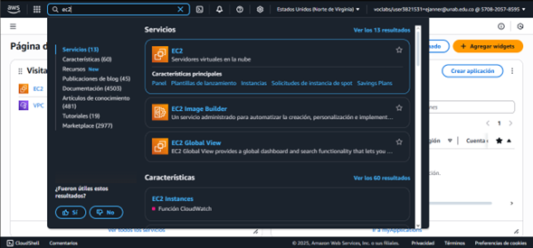

2. Ve a la opción para lanzar la instancia

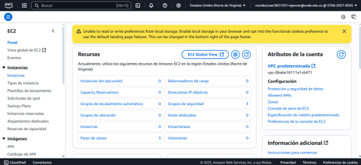

3. Lanza una instancia nueva

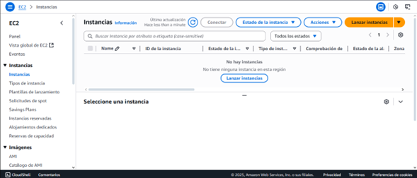

4. Inicia una nueva instancia EC2 en AWS (elige Ubuntu como sistema operativo), puede dejar la imagen por defecto.

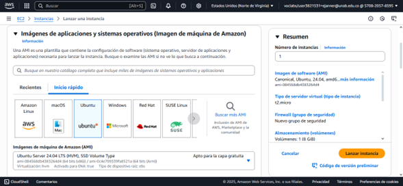

5. Para este proyecto dado que el tamaño del modelo a descargar es grande necesitamos una maquina con más memoria y disco. con nuestra licencia tenemos permiso desde un micro lanzar hasta un T2.Large.

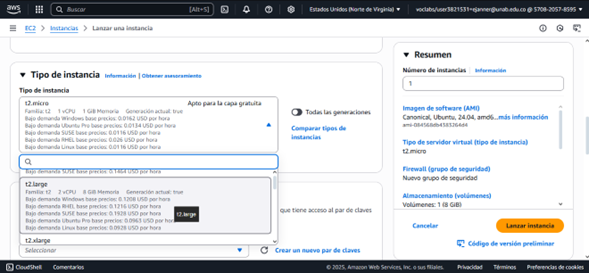

6. Seleccione el par de claves ya creado, o cree uno nuevo (Uno de los dos, pero recuerde guardar esa llave que la puede necesitar, no la pierda)

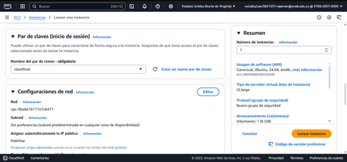

7. Habilite los puertos de shh, web y https, para este proyecto no lo vamos a usar no es necesario, pero si vas a publicar una web es requerido.

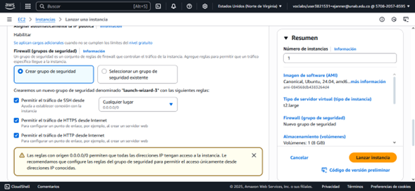

8. Configure el almacenamiento. Este proyecto como se dijo requiere capacidad en disco. Aumente el disco a 16 GiB.

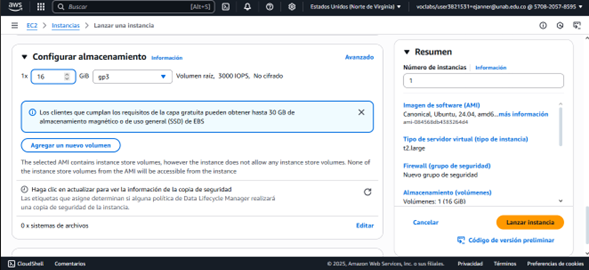

9. Finalmente lance la instancia (no debe presentar error, si tiene error debe iniciar de nuevo). Si todo sale bien, por favor haga click en instancias en la parte superior.

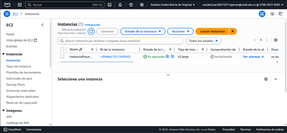

10. Vamos a seleccionar el servidor ec2 lanzado. Verificar la dirección IP pública y el DNS en el resumen de la instancia

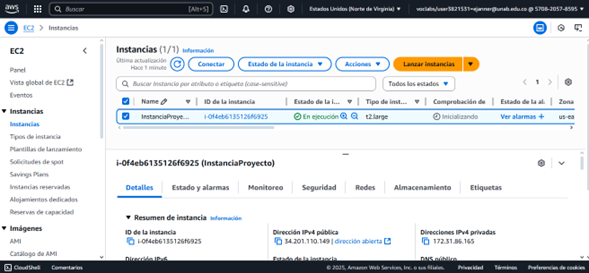

11. Debido a que vamos a lanzar un API rest debemos habilitar el puerto. Vamos al seguridad y luego vamos al grupo de seguridad

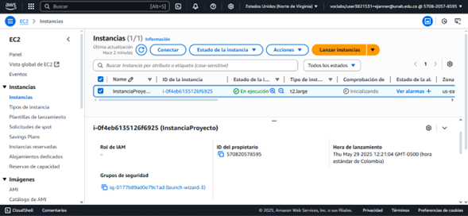

12. Vamos a ir a Editar la regla de entrada

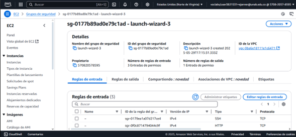

13. Ahora vamos a agregar un regla de entrada para habilitar el puerto, recuerden poner IPV 4

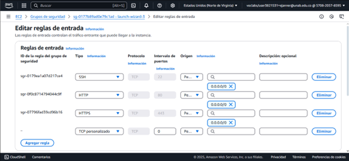

14. Abre un puerto en el grupo de seguridad (por ejemplo, puerto 8080) para permitir acceso a la API.

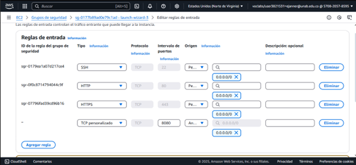

15. Guardemos la regla de entrada.

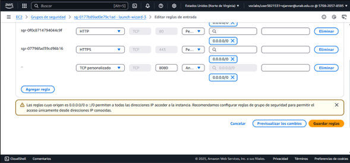

16. Ve nuevamente a instancias

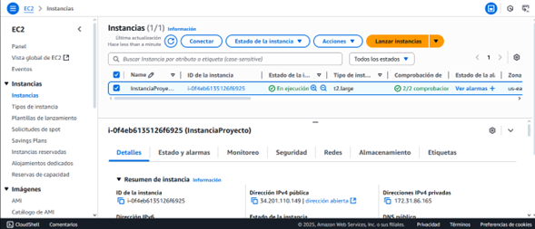

17. Vamos a conectar con la consola del servidor

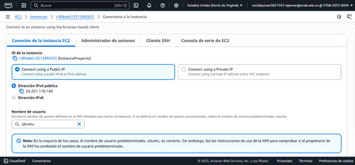


---

## Instalar dependencias en el Servidor EC2

Una vez dentro de tu instancia EC2, instalar las librerias y complementos como FastAPI y las dependencias necesarias para ello debes crear una carpeta en donde realizaras las instalaciones:

### Ver las carpetas
```bash
ls -la
```

### Ver la version de python
```bash
python3 -V
```

### Si se requiere, puede actualizar los paquetes
```bash
sudo apt update
```

### Instalar las siguientes instancias (images/imagen1)
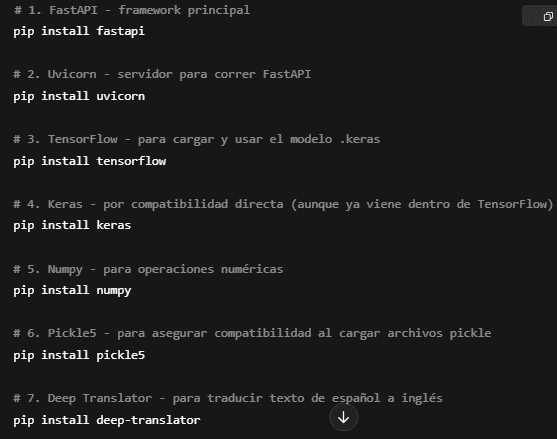

Si se requiere: Instalar pip y virtualenv
```bash
sudo apt update
```

Crear la carpeta del proyecto
```bash
sudo apt update
```

Accede a tu carpeta
```bash
sudo apt update
```

Crear y activar un entorno virtual
```bash
sudo apt update
```

Recuerda que en el prompt debe obersar que el env debe quedar activo
```bash
sudo apt update
```


## Crear la API FastAPI

Crea un archivo app.py en tu instancia EC2 para definir la API que servirá las predicciones.

```bash
nano app.py
```

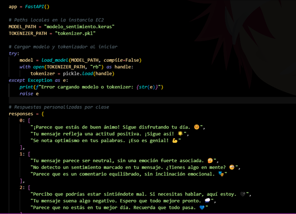


```bash
from fastapi import FastAPI, Request
from fastapi.responses import JSONResponse
from keras.models import load_model
from keras.preprocessing.sequence import pad_sequences
from deep_translator import GoogleTranslator
import numpy as np
import pickle
import os
import random
import uvicorn

app = FastAPI()

# Paths locales en la instancia EC2
MODEL_PATH = "modelo_sentimiento.keras"
TOKENIZER_PATH = "tokenizer.pkl"

# Cargar modelo y tokenizador al iniciar
try:
    model = load_model(MODEL_PATH, compile=False)
    with open(TOKENIZER_PATH, "rb") as handle:
        tokenizer = pickle.load(handle)
except Exception as e:
    print(f"Error cargando modelo o tokenizer: {str(e)}")
    raise e

# Respuestas personalizadas por clase
responses = {
    0: [
        "¡Parece que estás de buen ánimo! Sigue disfrutando tu día. 😊",
        "Tu mensaje refleja una actitud positiva. ¡Sigue así! 🌟",
        "Se nota optimismo en tus palabras. ¡Eso es genial! 💪"
    ],
    1: [
        "Tu mensaje parece ser neutral, sin una emoción fuerte asociada. 🤔",
        "No detecto un sentimiento marcado en tu mensaje. ¿Tienes algo en mente? 🧐",
        "Parece que es un comentario equilibrado, sin inclinación emocional. 🎭"
    ],
    2: [
        "Percibo que podrías estar sintiéndote mal. Si necesitas hablar, aquí estoy. 🖤",
        "Tu mensaje suena algo negativo. Espero que todo mejore pronto. 🌧️",
        "Parece que no estás en tu mejor día. Recuerda que todo pasa. 💙"
    ]
}

# Endpoint principal
@app.post("/predict/")
async def predict_sentiment(request: Request):
    try:
        data = await request.json()
        user_text = data.get("text", "").strip()

        if not user_text:
            return JSONResponse(content={"error": "Texto vacío o no enviado."}, status_code=400)

        # Traducir de español a inglés
        translated_text = GoogleTranslator(source='es', target='en').translate(user_text)

        # Procesar entrada
        sequence = tokenizer.texts_to_sequences([translated_text])
        padded = pad_sequences(sequence, maxlen=100, padding="post", truncating="post")
        prediction = model.predict(padded)
        score = prediction[0][0]

        if score < 0.4:
            sentiment_class = 2  # Negativo
        elif score > 0.6:
            sentiment_class = 0  # Positivo
        else:
            sentiment_class = 1  # Neutro

        response_text = random.choice(responses.get(sentiment_class, ["Error: Clase fuera de rango."]))
        sentimiento_nombre = ["Positivo", "Neutro", "Negativo"][sentiment_class]

        return JSONResponse(content={
            "sentimiento": sentimiento_nombre,
            "respuesta": response_text,
            "score": float(score)
        })

    except Exception as e:
        return JSONResponse(content={"error": str(e)}, status_code=500)

# Para ejecutar directamente si se corre como script
if __name__ == "__main__":
    uvicorn.run(app, host="0.0.0.0", port=8080)
```

Para salir del editor nano oprime CTRL-X y luego (Save modified buffer? ) escribe "Y" y (Save modified buffer? app.py) ENTER. puede verificar que archivo fue creado


## Ejecutar el Servidor FastAPI

Para ejecutar el servidor de FastAPI, usa Uvicorn:

```bash
source venv/bin/activate
uvicorn app:app --host 0.0.0.0 --port 8080 --reload
```

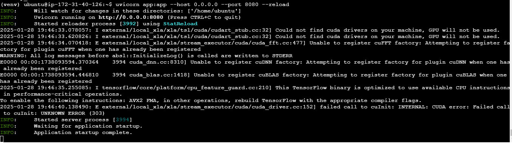

## Probar el servidor con un Curl desde el PowerShell del computador

Ejecutar el siguiente código para que envíe una predicción

```bash
Invoke-RestMethod -Uri http://3.82.114.41:8080/predict/ -Method POST -ContentType "application/json" -Body '{"text":"Estoy muy feliz con este proyecto"}'
```

---

## Desarrollo del Front-end


---

## Despliegue Final

### Revisar Configuración de Seguridad en AWS
Asegúrate de que el grupo de seguridad en AWS permita el tráfico en el puerto 8080 y que tu servidor sea accesible desde fuera de la red privada.

### Configuración de la manera de hacer el predict
Debe estar bien configurado el código con la parte del post en la aplicación movil ya que utilizar otras funciones diferentes a la del app.py del código de la instancia no valdrá la función y no dará la predicción.
---
